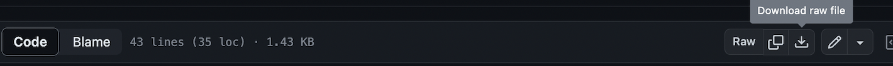
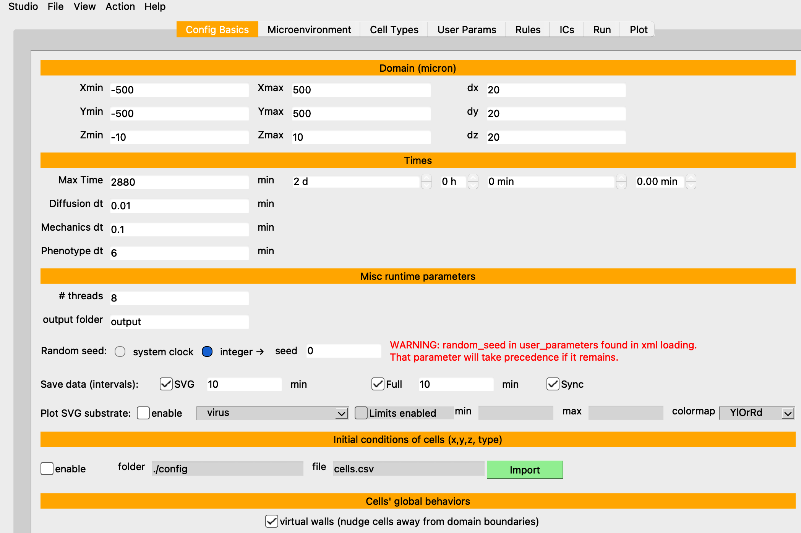
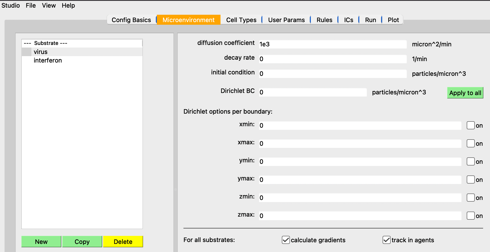
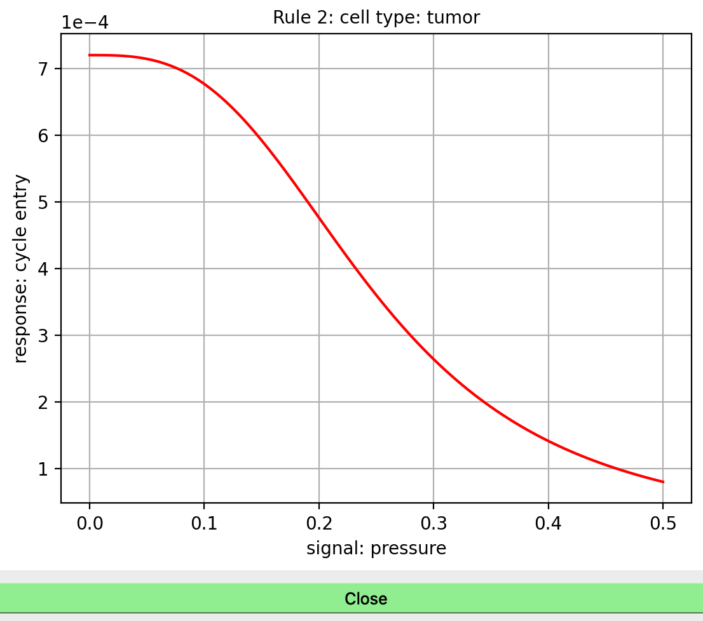
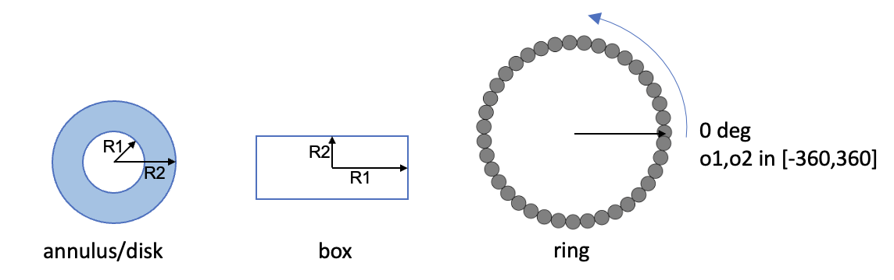
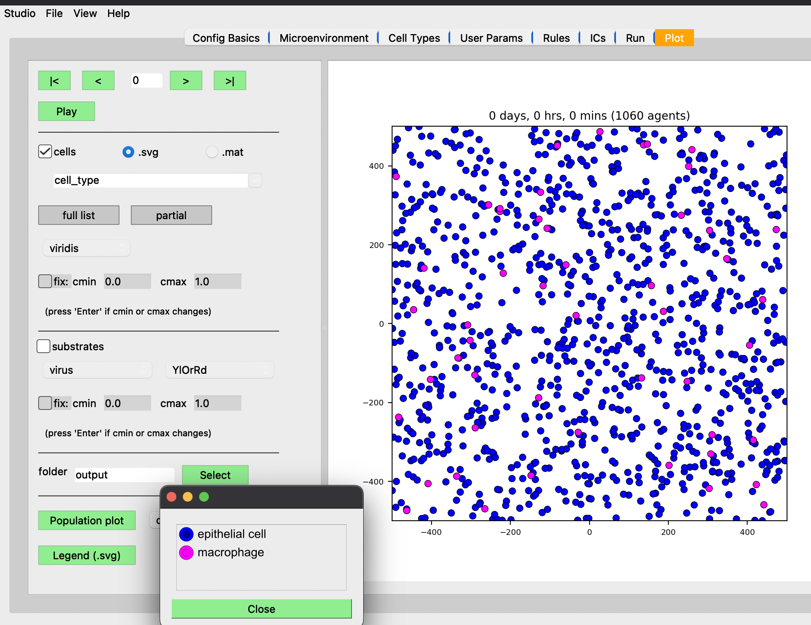
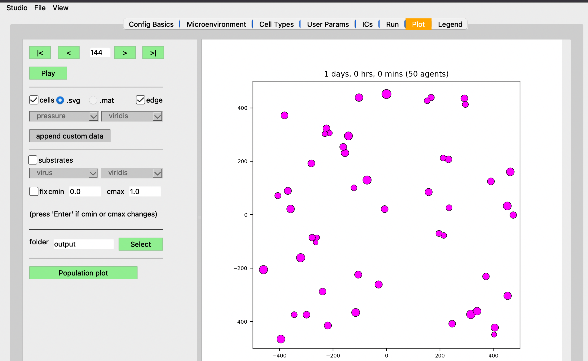

# PhysiCell Studio: User Guide

[[full images](README.md)]
[[small images](README-small-images.md)]

[ [[top](#physicell-studio-user-guide)] [[Config Basics](#config-basics)] [[Microenvironment](#microenvironment)] [[Cell Types](#cell-types)] [[User Params](#user-params)] [[Rules](#rules)] [[ICs](#ics-initial-conditions)] [[Run](#run)] [[Plot](#plot)] [[Plot 3D](#plot-3d)] }

PhysiCell Studio is a graphical tool to simplify PhysiCell model editing. It provides a multi-tabbed GUI that allows graphical editing of the model and its associated XML, including the creation/deletion of fundamental objects, e.g., substrates (or signals) in the microenvironment, and cell types. It also lets users run their model and interactively visualize results, allowing for more rapid model refinement.

This User Guide tries to provide brief, but sufficient, guidance on using the Studio - at least its contents (not the challenges involved in developing your particular model). If you experience problems or have questions, please contact us using an appropriate PhysiCell community Slack channel or the Issues section of this GitHub repository. The latter is preferred when reporting a fatal error using the Studio. We also welcome Pull Requests in the Studio's repository (see instructions there) for bug fixes and suggested improvements.

This Guide will be updated as the Studio itself is updated, however there may be a lag. Therefore, if you're running a recent release of the Studio, you may notice some differences in the content described here.

---
## Dependencies

We recommend installing the [Anaconda Python distribution](https://www.anaconda.com/products/individual) to have the necessary Python modules (used by the GUI, data parsing, and visualization). 

---
## Installing and Running the Studio

The most common way to run the Studio is from a PhysiCell root directory. Therefore, we assume you have installed
PhysiCell and, for the instructions here, we assume you've installed it in your home directory in a directory called
`PhysiCell` (without any version number suffix). To download the Studio and have it be installed in its own
directory inside the PhysiCell directory, click this link and download the `get_studio.py`:

* https://github.com/PhysiCell-Tools/PhysiCell-Studio/blob/main/get_studio.py 



Then run the script:
```
~/PhysiCell$ python get_studio.py
```

It will download and install the latest version of the Studio into a directory called `studio` (without any version number suffix). This script will also print out sample commands for running the Studio, the simplest being:

```
~/PhysiCell$ python studio/bin/studio.py
```

Optionally, you can specify the name of the executable model and its config (.xml) file via command line arguments, rf.:
```
~/PhysiCell$ python studio/bin/studio.py --help
```

Note:
* there are ways to create an alias and/or a symbolic link to make it easier to run the Studio
* you may need to prefix your executable name with `./`, depending on your PATH environment variable
* this guide will use a Unix-style command syntax; Windows syntax may differ
* when you File->Save or Run the model, the configuration file (.xml) will be updated. If you want to retain your original .xml, you should make a copy
---
## Studio Overview


The Studio consists of multiple tabs, each representing a logical grouping of model parameters and/or functionality.
Each tab will be described in detail in the sections below, but briefly they are:
* `Config Basics` - define the domain and other misc parameters of the simulation
* `Microenvironment` - define the microenvironment, i.e., one or more substrates (signals) and their parameters
* `Cell Types` - define one or more cell types and the phenotype parameters associated with each
* `User Params` - define optional "user" parameters that are unique to a particular model 
* `Rules` - optional "rules" associated with a cell type that define responses to signals
* `ICs` - convenience functionality to define simple 2D initial conditions (ICs) for cells
* `Run` - run a simulation and show the normal PhysiCell output to the terminal
* `Plot` - provide plotting options for visualizing output results (even while the simulation is being run)


[[Config Basics](#config-basics)] [[Microenvironment](#microenvironment)] [[Cell Types](#cell-types)] [[User Params](#user-params)] [[ICs](#ics-initial-conditions)] [[Run](#run)] [[Plot](#plot)] 

---
## Sample model: virus-macrophage

We will illustrate the Studio using the PhysiCell virus-macrophage model, i.e., we assume you have created
this model:
```
~/PhysiCell$ make reset
~/PhysiCell$ make virus-macrophage-sample
~/PhysiCell$ make 

# Note that the config/PhysiCell_settings.xml for the virus-macrophage-sample uses a hierarchical format
# in PhysiCell 1.12.0. The Studio requires a "flattened" format, therefore we provide one using the -c argument:
~/PhysiCell$ python studio/bin/studio.py -e virus-sample -c studio/config/virus_macrophage.xml 
```

---
## Config Basics




* === Domain ===
* define the model domain size (we recommend leaving dx=dy=dz=20). A 2D model will have Z range: [-dz/2, dz/2, dz]
* === Times ===
* `Max Time` - of the simulation. `+1 day` convenience button to add 1440 mins (1 day)
* `Diffusion/Mechanics/Phenotype dt` - 3 time scales in a PhysiCell model (rf. the PhysiCell method paper). Only modify if you're an advanced user.
* === Misc runtime params ===
* `# threads` - # of OpenMP threads (to help speed up calculations)
* `output folder` - where the output files will be written; relative to where you Run the simulation.
* `Save data(intervals)` - there are (primarily) two types of output files saved by PhysiCell: `SVG` (.svg; for cells' positions, sizes, colors) and `Full` (.mat; for substrate concentrations and custom data). Currently, in the Plot tab, when you plot *both* cells and substrates, it assumes those files were written at the same simulation time. Therefore, you should provide the *same* interval value for both if you plan to plot both. The `Sync` checkbox helps ensure this. However, if you only plan to plot cells' SVG files, then you can set the `Full` interval to a very high value or simply uncheck it to not have any substrate or cells' custom data saved.
* === Initial conditions of cells ===
* `enable` - check if you are providing a text file that contains data for the initial conditions of cells, including their positions, cell types, etc.
* === Cells' global behaviors
*  `virtual walls` - if checked, indicates that cells should be nudged away from the domain boundaries when they get too close
*  `disable springs` - if checked, do not perform elastic spring attachments between cells

[ [top](#physicell-studio-user-guide)] [[Config Basics](#config-basics)] [[Microenvironment](#microenvironment)] [[Cell Types](#cell-types)] [[User Params](#user-params)] [[Rules](#rules)] [[ICs](#ics-initial-conditions)] [[Run](#run)] [[Plot](#plot)] [[Plot 3D](#plot-3d)]

---
## Microenvironment



* Define the substrates (or signals) used in the model
* Selecting one in the box on the left will update the parameters on the right.
* The `New` button will create a new substrate with default parameters
* The `Copy` button will create a new substrate with the same parameters as the currently selected substrate
* The `Delete` button will delete the currently selected substrate
* To rename a substrate, double-click it, modify the name, and press the Enter/Return key
* The parameters on the right should be mostly self-explanatory. However, note that the `Dirichlet BC`(Boundary Condition) `Apply to all` button only copies the value provided to each of the boundaries. It does *not* toggle on (enable) those boundaries. You must explicitly enable any boundary that you want to be Dirichlet conditions.
* `calculate gradients` - check if you want substrate gradients to be computed at each "Mechanics dt" timestep. You would need to do so, for example, if certain cell types were chemotaxing (rf. Cell Types | Motility subtab).
* `track in agents` - check if you want cells to keep track of the substrate concentration during secretion

[ [top](#physicell-studio-user-guide)] [[Config Basics](#config-basics)] [[Microenvironment](#microenvironment)] [[Cell Types](#cell-types)] [[User Params](#user-params)] [[Rules](#rules)] [[ICs](#ics-initial-conditions)] [[Run](#run)] [[Plot](#plot)] [[Plot 3D](#plot-3d)]

---
## Cell Types


* This tab is used to define the phenotype for each cell type and therefore exposes a large number of parameters. Note that it has subtabs, one for each phenotypic cell behavior.

<details>
  <summary><h3>Expand to show Cell Types phenotype subtabs</h3></summary>

[[cycle](#cycle)] [[death](#death)] [[volume](#volume)] [[mechanics](#mechanics)] [[motility](#motility)] [[secretion](#secretion)] [[interactions](#interactions)] [[intracellular](#intracellular)] [[custom-data](#custom-data)] 

  ### Cycle
  

   Define the cycle parameters for this cell type.
  
  ### Death
  

   Define the death parameters for this cell type.

  ### Volume
  

   Define the volume parameters for this cell type.

  ### Mechanics
  

   Define the mechanics parameters for this cell type.

  ### Motility
  

  

   Define the motility parameters for this cell type.

  ### Secretion
  

   Define the secretion/uptake parameters for this cell type.

  ### Interactions
  

   Define the interactions parameters for this cell type.

  ### Intracellular
  

   Define the intracellular parameters for this cell type.

  ### Custom Data
  

   Define the custom data parameters for this cell type.


</details>

[ [top](#physicell-studio-user-guide)] [[Config Basics](#config-basics)] [[Microenvironment](#microenvironment)] [[Cell Types](#cell-types)] [[User Params](#user-params)] [[Rules](#rules)] [[ICs](#ics-initial-conditions)] [[Run](#run)] [[Plot](#plot)] [[Plot 3D](#plot-3d)]

---
## User Params

  

User parameters are general model parameters (as opposed to Cell Types | Custom Data parameters which are specific to cell data). User parameters are accessed in your model's C++ code. Search for `parameters.ints, parameters.doubles`, etc, in various sample projects' `custom.cpp` files. You can click/drag a column separator in this table to change its width. (Unfortunately, that column width information is not retained if you exit the Studio and start it again)

[ [top](#physicell-studio-user-guide)] [[Config Basics](#config-basics)] [[Microenvironment](#microenvironment)] [[Cell Types](#cell-types)] [[User Params](#user-params)] [[Rules](#rules)] [[ICs](#ics-initial-conditions)] [[Run](#run)] [[Plot](#plot)] [[Plot 3D](#plot-3d)]

---
## Rules

  

This section is independent of the others in this guide in that it does not relate to the virus-macrophage sample project.

The Rules tab is a recent addition to the Studio and will continue to be improved in future releases. 
The rules functionality in PhysiCell is both powerful and elegant. A rule, for a cell type, specifies how
that cell will respond to a specific signal. In other words, rules will determine cell behaviors. The response
is defined by a Hill function and its parameters are also specified in this tab, along with comboboxes that
list the Signals and Behaviors. For an introductory tutorial on using rules, see https://github.com/physicell-training/nw2023. The screenshots shown here reflect that tutorial.

  

[ [top](#physicell-studio-user-guide)] [[Config Basics](#config-basics)] [[Microenvironment](#microenvironment)] [[Cell Types](#cell-types)] [[User Params](#user-params)] [[Rules](#rules)] [[ICs](#ics-initial-conditions)] [[Run](#run)] [[Plot](#plot)] [[Plot 3D](#plot-3d)]

---
# ICs (Initial Conditions)

The ICs tab provides a graphical tool that lets you create fairly simple initial conditions of cells. For now, those ICs are just x,y,z positions and cell type (by name or ID). The currently supported geometric regions in which cells can be placed are annuli (or disks), boxes (rectangles), or rings. The center of any of those regions is specified using x0,y0,z0. R1 and R2 represent the distances/radii. For boxes, R1= (absolute) x-distance from the center to each left/right edge; R2= y-distance from the center to each top/bottom edge; For an annulus: R1= inner radius; R2= outer radius (if R1=0, the shape becomes a disk). Each region can be filled in two different ways: randomly or hex-filled. You only specify the # of cells for the random fill. o1 and o2 (omegas) represent degrees for the start/end of a ring of cells (o1,o2 in range [-360,360]). Note that you can select a cell type from the combobox at the top. The size (radius) of each cell is determined by the Cell Types | Volume (total) parameter.



The typical steps are: select the geometric region type, fill type (if relevant), # cells (if fill type = random), center of region, R1 and R2, or o1 and o2. Then click `Plot` to see if they appear where you expect. If not, either click `Undo last` or `Clear all`. Repeat if you have more regions to fill with ICs. When you have the ICs you want, click `Save` to write out the .csv file to the specified folder and filename. The `use cell type names` are the newer (v2 format) way of providing a cells.csv file. If that box is unchecked, the .csv file will be written with cell type IDs instead (v1 format).

In the following image, we demonstrate with a simple example. Here, we have loaded the template model (hence the `default` cell type). With the selected geometric region `annulus/disk`, `random fill`, `# cells` = 100, and the specified center and radii, we click `Plot` to see the result. Note that since R1 > 0, it will indeed be an annulus; if R1=0, we would have a disk.


In the following, we create ICs for two cell types, each in a different region.
* `Clear all` to start fresh
* select cell type=`default`; create a hex-filled disk; Plot
* select cell type=`ctype2`; create a hex-filled rectangle; Plot
* if we make a mistake for one of the Plots, use `Undo last`
* provide a unique .csv filename instead of `cell.csv` if you want, and click `Save`


The .csv file should contain content that looks similar to the following. Note that since we had `use cell type names` checked, each line will include the name of that cell type. Also, in this case, there will be a single header line at the top that starts with `x` (for the x-coordinate column). If we don't check the `use cell type names`, this is the older style of .csv and it will use cell IDs (integer values) instead of cell type names. And there will not be a header line.
```
x,y,z,type,volume,cycle entry,custom:GFP,custom:sample
-81.2695257531903,-285.4287579015727,0.0,default
-64.44410465728185,-285.4287579015727,0.0,default
-47.618683561373416,-285.4287579015727,0.0,default
-30.793262465464977,-285.4287579015727,0.0,default
...
422.0635527397712,424.27452590563917,0.0,ctype2
380.0,438.8457680040665,0.0,ctype2
396.82542109590844,438.8457680040665,0.0,ctype2
413.65084219181693,438.8457680040665,0.0,ctype2
```

[ [top](#physicell-studio-user-guide)] [[Config Basics](#config-basics)] [[Microenvironment](#microenvironment)] [[Cell Types](#cell-types)] [[User Params](#user-params)] [[Rules](#rules)] [[ICs](#ics-initial-conditions)] [[Run](#run)] [[Plot](#plot)] [[Plot 3D](#plot-3d)]

---
# Run


[ [top](#physicell-studio-user-guide)] [[Config Basics](#config-basics)] [[Microenvironment](#microenvironment)] [[Cell Types](#cell-types)] [[User Params](#user-params)] [[Rules](#rules)] [[ICs](#ics-initial-conditions)] [[Run](#run)] [[Plot](#plot)] [[Plot 3D](#plot-3d)]

---
# Plot

When you start a simulation (using the Run tab) and output files are generated, you can begin visualizing results. In the Plot tab, click `Play` to 
start rendering those results. The `Play` button will switch to `Pause`, so you can halt and restart easily. The two primary objects to visualize are cells and substrates, each with a checkbox toggle. Assuming you selected "SVG" in the `Config Basics` tab ("Save data" section), then .svg files will be written (at the specified time interval of the simulation) and can be plotted when the `.svg` radio button is selected. Your model's C++ code can specify unique cell colors for the SVG (related to, but not necessarily the same as, those in `Legend(.svg)` button). 

Alternatively, you can plot cells' scalar values when the `.mat` radio button is selected. There are many types of scalar variables for cells that are stored in the .mat files. You can see the entire list using the `full list` button, then click the combobox above it. These scalar variables will be a combination of hard-coded ones by PhysiCell and model-specific ones defined in the `Cell Types | Custom Data` subtab. The `partial` button will populate the combobox with a more customary subset of scalar variables. Note that you can select a colorbar for the cells' scalars and can fix lower/upper bounds for the values, if that's desired. Otherwise, the colorbar will be dynamic and use the min/max of the current frame of data.

We show four snapshots of .svg data during the time series of the virus-macrophage simulation.



---


Plotting the cells' `pressure` scalar (.mat) field.

---


The `Population plot` button will generate a time series plot of the cell (types) populations. This will appear in a separate popup window (and sometimes may get hidden behind the main Studio window).

[ [top](#physicell-studio-user-guide)] [[Config Basics](#config-basics)] [[Microenvironment](#microenvironment)] [[Cell Types](#cell-types)] [[User Params](#user-params)] [[Rules](#rules)] [[ICs](#ics-initial-conditions)] [[Run](#run)] [[Plot](#plot)] [[Plot 3D](#plot-3d)]

---
# Plot 3D

It is also possible to run and visualize results from a 3D model. However, the Studio must be *started* with a special argument: `-3` or `--3D`. It is not currently possible to switch between 2D and 3D plotting in the same Studio session. In 2D, as we've seen, cells are displayed as circles and substrates as colored planar meshes. In 3D, cells are displayed as spheres and substrates/signals are displayed using orthogonal slicing planes and/or a contour surface. To help visualize a crowded domain of cells, it is also possible to hide orthogonal regions using clipping planes (see the `View` menu). Currently, we provide a minimal, but hopefully useful set of options for plotting in 3D. More options will be added. We also provide interfaces to [community tools](#Community-Tools) to visualize output files from a PhysiCell simulation.
```
# if running from the Studio root folder:
python bin/studio.py -e project -c config/simple3D_test1.xml -3
```


* by default, we plot cells colored by cell type (note the colorbar is not yet labeled for discrete values)

* use the `View` menu to see options for displaying and filtering 3D results


---


* click `partial` to populate the combobox then select `pressure`

* the colorbar range will dynamically update to the min/max of the cells' pressure values for that frame in time

---


* after checking `fix`, we can manually specify the colorbar range min/max for all frames


<details>
  <summary><h3>Expand for 3D Plotting interaction hints</h3></summary>

For 3D plotting, the following are useful commands to affect the display and mode of interaction:

  * Keypress j / Keypress t: toggle between joystick (position sensitive) and trackball (motion sensitive) styles. In joystick style, motion occurs continuously as long as a mouse button is pressed. In trackball style, motion occurs when the mouse button is pressed and the mouse pointer moves.

  * (Warning: you should just stay in camera mode) Keypress c / Keypress a: toggle between camera and actor modes. In camera mode, mouse events affect the camera position and focal point. In actor mode, mouse events affect the actor that is under the mouse pointer.

  * Button 1: rotate the camera around its focal point (if camera mode) or rotate the actor around its origin (if actor mode). The rotation is in the direction defined from the center of the renderer's viewport towards the mouse position. In joystick mode, the magnitude of the rotation is determined by the distance the mouse is from the center of the render window.

  * Button 2: pan the camera (if camera mode) or translate the actor (if actor mode). In joystick mode, the direction of pan or translation is from the center of the viewport towards the mouse position. In trackball mode, the direction of motion is the direction the mouse moves. (Note: with 2-button mice, pan is defined as <shift>-Button 1.)
  
  * Button 3: zoom the camera (if camera mode) or scale the actor (if actor mode). Zoom in/increase scale if the mouse position is in the top half of the viewport; zoom out/decrease scale if the mouse position is in the bottom half. In joystick mode, the amount of zoom is controlled by the distance of the mouse pointer from the horizontal centerline of the window.

  * Keypress 3: toggle the render window into and out of stereo mode. By default, red-blue stereo pairs are created. Some systems support Crystal Eyes LCD stereo glasses; you have to invoke SetStereoTypeToCrystalEyes() on the rendering window.

  * Keypress f: fly to the picked point
  
  * Keypress r: reset the camera view along the current view direction. Centers the actors and moves the camera so that all actors are visible.

  * Keypress s: modify the representation of all actors so that they are surfaces.

  * Keypress w: modify the representation of all actors so that they are wireframe.
  
  * (Warning: avoid) Keypress p: perform a pick operation. The render window interactor has an internal instance of vtkCellPicker that it uses to pick.

  
</details>

---
# Community Tools

The Studio provides interfaces to other tools used in the broader modeling community. 
  
## Simularium
  
[Simularium](https://simularium.allencell.org/) offers interactive visualization in a browser. We have collaborated with their team to provide scripts that will convert PhysiCell output files into a compressed, binary file that can be loaded into their [viewer](https://simularium.allencell.org/viewer). The Simularium viewer offers a complementary set of options to the Studio.


---
  
## ParaView
  
[ParaView](https://www.paraview.org/) is a popular open source application for scientific visualization. We provide scripts that assist with loading PhysiCell data. More coming...

  
[ [top](#physicell-studio-user-guide)] [[Config Basics](#config-basics)] [[Microenvironment](#microenvironment)] [[Cell Types](#cell-types)] [[User Params](#user-params)] [[Rules](#rules)] [[ICs](#ics-initial-conditions)] [[Run](#run)] [[Plot](#plot)] [[Plot 3D](#plot-3d)]

